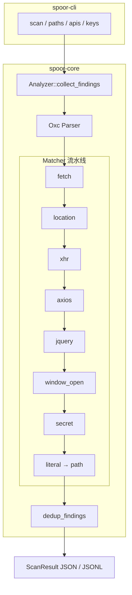

# Spoor 整体开发进度与功能规划

**整体进度与功能规划：** [docs/DEVELOPMENT.md](./docs/DEVELOPMENT.md)（进度快照）

**分阶段计划（plan 文件）：**

| 文件 | 内容 |
|------|------|
| [plan1.md](../plan1.md) | 总体计划、进度、Phase 0–1 清单 |
| [plan2.md](../plan2.md) | 命名 + JSON 输出模型 |
| [plan3.md](../plan3.md) | Phase 2：密钥 + 红队 URL 增强 |
| [plan4.md](../plan4.md) | Phase 3：并行、规则、工程化 |
| [plan5.md](../plan5.md) | Phase 4：高级能力（按需） |

阶段回顾：

- [Phase 0 retro](./superpowers/plans/2026-05-31-spoor-phase-0-retro.md)
- [Phase 1 retro](./superpowers/plans/2026-05-31-spoor-phase-1-retro.md)

**仓库：** https://github.com/P0m32Kun/Spoor  
**最后更新：** 2026-05-31  
**当前版本：** 0.1.0（未打 tag）  
**测试：** 27 passed · **Commits：** 13+ on `main`

---

## 1. 项目是什么

Spoor 是在 JavaScript / TypeScript 资产里做**静态信息收集**的 CLI 工具，面向红队场景：

| 产出类型 | `kind` | 用途示例 |
|----------|--------|----------|
| 路径足迹 | `path` | `/api/v1/users`、静态资源路径 → ffuf、目录爆破 |
| API 端点 | `endpoint` | `fetch` / `location` / XHR 可发起的请求 → 接口梳理 |
| 密钥泄漏 | `secret` | AKIA、sk-、API Key → 凭证排查 |

**对标：** [jsluice](https://github.com/BishopFox/jsluice)（Go，维护放缓）  
**解析引擎：** [Oxc](https://oxc.rs/)（Rust，高性能 AST）  
**设计原则：** 先对齐 jsluice 核心能力，再在红队场景扩展（axios、GraphQL、规则文件等）

---

## 2. 整体进度一览

```
Phase 0  基础解析 + 字面量路径     ████████████████████ 100%  ✅ 已签 off
Phase 1  语义 endpoint matcher      ████████████████████ 100%  ✅ 已签 off
Phase 2  密钥 + 红队 URL 增强      ████████░░░░░░░░░░░░  40%  🚧 进行中
Phase 3  并行 / 规则 / 工程化      ░░░░░░░░░░░░░░░░░░░░   0%  📋 未开始
Phase 4  高级能力（可选）          ░░░░░░░░░░░░░░░░░░░░   0%  📋 按需
```

| 阶段 | 目标（一句话） | 状态 | 文档 |
|------|----------------|------|------|
| **Phase 0** | 能解析 JS，从字符串字面量提取 path | ✅ 完成 | [retro](./superpowers/plans/2026-05-31-spoor-phase-0-retro.md) |
| **Phase 1** | `spoor apis` 输出 fetch/location/XHR/jquery/axios endpoint | ✅ 完成 | [retro](./superpowers/plans/2026-05-31-spoor-phase-1-retro.md) · [plan](./superpowers/plans/2026-05-31-spoor-phase-1.md) |
| **Phase 2** | `spoor keys` + WebSocket/GraphQL 等 | 🚧 ~40% | [plan3.md](../plan3.md) |
| **Phase 3** | 目录并行扫描、YAML 规则、性能基准 | 📋 未开始 | [plan4.md](../plan4.md) |
| **Phase 4** | regex 兜底、SARIF、WASM/NAPI | 📋 按需 | [plan5.md](../plan5.md) |

**Phase 1 已 100%：** fetch / location / XHR（收紧）/ jQuery / window.open / axios / query_params / 去重 / jsluice 子集 fixture 均已交付。

**Phase 2 进行中：** secret matcher（AKIA、sk-、对象键）、`spoor keys` 与 `scan` 已可用；WebSocket / GraphQL / GCP 等待做。

---

## 3. 功能矩阵（你现在能用什么）

### 3.1 CLI 命令

| 命令 | 作用 | 当前能力 | 计划 |
|------|------|----------|------|
| `spoor scan <file>` | 全类 finding | path + endpoint + secret | — |
| `spoor paths <file>` | 仅 path | ✅ 字面量路径 | 不变 |
| `spoor apis <file>` | 仅 endpoint | ✅ fetch / location / XHR / jQuery / axios / window.open | + WebSocket 等 |
| `spoor keys <file>` | 仅 secret | ✅ AKIA / sk- / 对象键 | + GCP 等 |
| `-` stdin | 管道输入 | ✅ | — |
| `-o` / `--jsonl` | 文件输出 / 行式 JSON | ✅ | — |
| 目录递归 `./dist/` | 批量扫描 | ❌ 仅单文件 | Phase 3 + rayon |
| `--no-literals` 等过滤 | 降噪 | ❌ | Phase 3 |

### 3.2 Endpoint Matcher（`spoor apis`）

| Matcher | 触发模式 | 状态 | 代码 |
|---------|----------|------|------|
| **fetch** | `fetch(url, { method })` | ✅ | `matcher/fetch.rs` |
| **location.href** | `location.href = url` | ✅ | `matcher/location.rs` |
| **location.replace / assign** | `location.replace(url)` | ✅ | 同上 |
| **window.location** | `window.location = url` | ✅ | 同上 |
| **XHR.open** | `xhr.open(method, url)`（仅 `new XMLHttpRequest()` 绑定） | ✅ 已收紧 | `matcher/xhr.rs` |
| **jQuery** | `$.get` / `$.post` / `$.ajax` | ✅ | `matcher/jquery.rs` |
| **axios** | `axios.get/post/request(...)` | ✅ | `matcher/axios.rs` |
| **window.open** | `window.open(url)` | ✅ | `matcher/window_open.rs` |
| **string literal** | 兜底 → `path` | ✅ | `matcher/literal.rs` |
| ky / got / superagent | 现代 HTTP 库 | ❌ Phase 2 P1 | — |
| WebSocket | `new WebSocket(url)` | ❌ Phase 2 | — |
| GraphQL | `/graphql`、`gql`… | ❌ Phase 2 | — |
| 泛化 call | 首参像 URL 的任意调用 | ❌ Phase 2+ | — |

### 3.3 Secret 检测（`spoor keys`）

| 类型 | 状态 |
|------|------|
| AWS Access Key（AKIA） | ✅ |
| sk- / GitHub token 粗匹配 | ✅ |
| 对象键启发（apiKey、token…） | ✅ |
| GCP / Firebase | ❌ Phase 2 |
| REACT_APP_* / VITE_* / process.env | ❌ Phase 2（可选） |

### 3.4 基础设施

| 能力 | 状态 | 说明 |
|------|------|------|
| Oxc JS/TS 解析 | ✅ | 坏 JS 可部分恢复 |
| `collapsed_string` + `EXPR` | ✅ | 字符串拼接折叠 |
| `resolved_maybe_url` / query_params | ✅ | fetch 等拒绝 EXPR；URL 解析 query 参数名 |
| jsluice 对比测试集 | ⚠️ | 有 `jsluice_subset.js` fixture，无自动 diff |

---

## 4. 架构（当前实现）



**输出模型（plan2）：** 每条 finding 含 `kind`、`value`、`confidence`、`origin`（pattern / snippet / line）；endpoint 额外有 `method`；secret 有 `secret_type` / `severity` / `context.nearby_keys`。

---

## 5. 分阶段规划详情

### Phase 2 — 密钥与红队增强（约 2 周，进行中 ~40%）

**交付目标：** `spoor keys` 有真实输出；`spoor scan` 一次跑 path + endpoint + secret。

| 工作包 | 内容 | 状态 |
|--------|------|------|
| Secrets 基础 | AKIA、sk-、对象键启发 | ✅ |
| HTTP 客户端 | axios、jQuery、window.open | ✅ |
| URL 增强 | query_params、XHR 收紧 | ✅ |
| Secrets 扩展 | GCP/Firebase/PAT 细粒度 | ❌ |
| 协议/路由 | WebSocket、GraphQL、react-router | ❌ |
| 质量 | Phase 2 retro | ❌ |

### Phase 3 — 性能与工程化（约 2 周）

| 工作包 | 内容 |
|--------|------|
| 规模 | 目录递归 + `rayon` 并行 |
| 扩展 | `Matcher` trait 注册、YAML 规则文件 |
| DX | `--no-literals`、`--min-severity`、Burp/ffuf 管道示例 |
| 质量 | hyperfine 对比 jsluice（目标 ≥5× 单文件） |

### Phase 4 — 高级能力（按需）

Minified regex 兜底、Webpack 动态 import、模块图、SARIF、WASM/NAPI。

---

## 6. 测试与质量现状

| 类型 | Phase 0 | Phase 1 | 目标 |
|------|---------|---------|------|
| 单元测试 | ✅ string_fold, url | ✅ matcher, dedup, analyzer | 持续 |
| 集成 fixture | sample.js, broken.js | fetch/location/xhr, phase1/combined | + jsluice 对比 |
| CLI 测试 | ❌ | ❌ | insta 快照 |
| fmt / clippy | ✅ | ✅ | CI 固化 |
| 模糊测试 | ❌ | ❌ | Phase 4 |

---

## 7. 已知限制（使用前要知）

1. **单文件扫描** — 暂不支持递归目录。
2. **动态 URL** — `fetch(base + "/path")` 不会产出 endpoint（仅 literal `/path` 可能作为 path）。
3. **GCP / Firebase** — 云厂商凭证模式尚未覆盖。
4. **WebSocket / GraphQL** — 协议类 URL 待 Phase 2 后续 task。
5. **无 HTML** — 不能直接丢 `.html` 抽 script。

---

## 8. 文档索引

| 文档 | 用途 |
|------|------|
| [README.md](../README.md) | 安装、用法、Phase 1 能力摘要 |
| **本文档** | 整体进度与功能全景 |
| [plan1.md](../plan1.md) | 总体计划与 Phase 0–1 进度 |
| [plan2.md](../plan2.md) | 命名 + JSON 模型 |
| [plan3.md](../plan3.md) | Phase 2 详细计划 |
| [plan4.md](../plan4.md) | Phase 3 详细计划 |
| [plan5.md](../plan5.md) | Phase 4 详细计划 |
| [Phase 0 retro](./superpowers/plans/2026-05-31-spoor-phase-0-retro.md) | Phase 0 签 off 证据 |
| [Phase 1 retro](./superpowers/plans/2026-05-31-spoor-phase-1-retro.md) | Phase 1 签 off 证据 |
| [Phase 1 plan](./superpowers/plans/2026-05-31-spoor-phase-1.md) | Phase 1 实施任务（已完成） |

---

## 9. 建议的下一步优先级

1. **WebSocket + GraphQL matcher** — plan3 Task D
2. **GCP / Firebase secret** — plan3 Task B
3. **目录扫描** — 红队扫 `dist/` / `.next/` 的刚需（Phase 3）
4. **Phase 2 retro** — 签 off 证据文档

---

*维护说明：每完成一个 Phase 签 off 时，更新 §2 进度条、§3 功能矩阵，并新增对应 retro 文档链接。*
